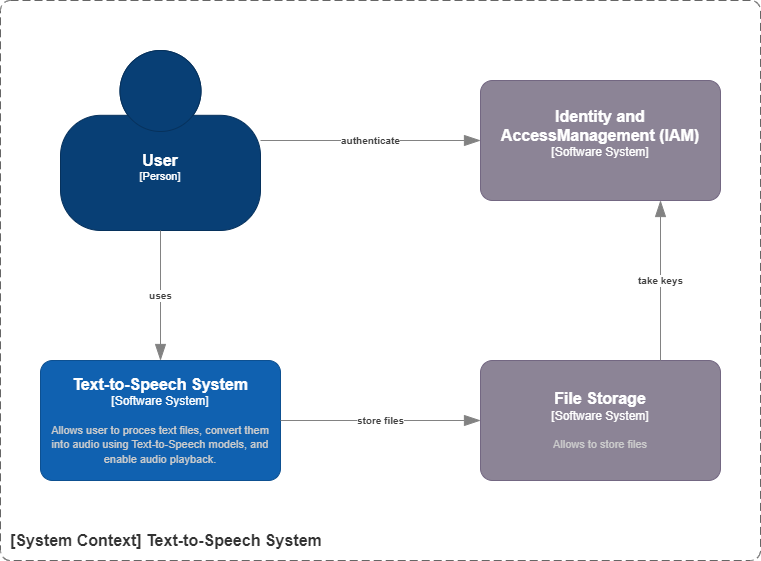

# Text-to-Speech System Architecture
_This document outlines the architectural blueprint for the Text-to-Speech (TTS) system, providing a structured and comprehensive overview of its design, components, and operational considerations. The report leverages the arc42 template for its standardized, pragmatic structure and integrates the C4 model for clear, hierarchical visual representations of the architecture._

The TTS system is designed to process text files (TXT, PDF), convert them into audio using Text-to-Speech models, and enable audio playback. Its core components include an Angular-based Frontend application, a Synthesizer application responsible for text-to-audio conversion, a File Storage application for managing files, and Keycloak as an identity provider.

# Table of Contents
1. [Introduction and Goals](#1-introduction-and-goals)
2. [Architecture Constraints](#2-architecture-constraints)
3. [System Scope and Context](#3-system-scope-and-context)
4. [Solution Strategy](#4-solution-strategy)
5. [Building Block View](#5-building-block-view)
6. [Runtime View](#6-runtime-view)
7. [Deployment View](#7-deployment-view)
8. [Crosscutting Concepts](#8-crosscutting-concepts)
9. [Architecture Decisions](#9-architecture-decisions)
10. [Quality Requirements](#10-quality-requirements)
11. [Risks and Technical Debt](#11-risks-and-technical-debt)
12. [Glossary](#12-glossary)

# 1. Introduction and Goals
_This section establishes the foundational context for the TTS system, defining its purpose, identifying stakeholders, and outlining the quality attributes that guide its design._

## 1.1. Requirements Overview
The primary functional requirement of the TTS system involves:
- capability to upload various text file formats, specifically TXT and PDF;
- subsequently convert files content into audio;
- ability to play the generated audio; and
- manage user accounts. 

Beyond core functionality, the system is designed to meet several high-level non-functional requirements. These include:
- ensuring efficient audio generation performance;
- maintaining high system availability; and 
- ensuring the overall maintainability of the codebase.

## 1.2. Quality Goals
The top quality attributes for the TTS system are critical drivers for its architectural design. These include:
- achieving high performance in audio generation;
- ensuring scalability to support a growing number of concurrent users;
- implementing strong security for user data and access control; and
- designing for maintainability to facilitate future enhancements.

## 1.3. Stakeholders
| Name      | Describtion                                                   | Primary Sections of Interest  |
| --------  | -------                                                       | -------                       | 
| End-User  | System functionality                                          | 1, 3.1, 6                     |
| Developer | Code structure, APIs, integration points, implementation      | 4, 5, 6, 8, 9, 11             |
| DevOps    | Deployment, infrastructure, monitoring, scalability           | 5, 6, 7, 8, 10, 11            |

# 2. Architecture Constraints
_This section delineates the significant limitations and restrictions that exert influence over the architectural design and subsequent implementation of the system._

# 3. System Scope and Context
_This section precisely defines the boundaries of the TTS system and illustrates its interactions with external sytems._

## 3.1. Business Context

The business context describes the TTS system as a black box, illustrating its interactions with various users and other systems in its environment.

# 4. Solution Strategy
_This section provides a high-level summary of the fundamental architectural decisions and guiding principles that shape the TTS system's design. It serves as a bridge between the high-level context and constraints and the more detailed building block views, explaining the rationale and guiding philosophy behind the system's structure._

| Goal              | Describtion   |
| ------            | ------        |
| microservices approach | The overall architectural style adopted for the TTS system leans towards a microservices approach. This choice supports key design principles such as an API-first approach, promoting loose coupling between services. |
| security          | Keycloak was chosen for robust identity management, leveraging its support for standard protocols like OAuth2 and OpenID Connect. |

# 5. Building Block View
_This section describes the static decomposition of the TTS system into its major software components, referred to as building blocks, and illustrates their relationships._

This diagram depicts the main systems: Text-to-Speech System, File Storage  and IAM.

| System        | Description   |
| -----         | ------        |
| Text-to-Speech System | Main system |
|Identity and Access Management (IAM) system |	System responsible for authentication and user management. |
| File Storage | System responsible for storing files | 

## 5.1. Level 1: Container Diagram - Text-to-Speech System
This diagram provides a clear overview of the system's major deployable units and their communication pathways.

| Containers | Description |
| ----- | ------ |
| Frontend | Provides system functionality to user |
| Synthesizer | Convert text to audio using Text-to-Speech moodels |

### 5.1.1. Level 2: Component Diagram - Frontend
// todo link to the project

### 5.1.2. Level 2: Component Diagram - Synthesizer
// todo link to the project

# 6. Runtime View
_This section details the dynamic behavior of the TTS system by illustrating how its building blocks interact over time to fulfill key use cases and scenarios. It provides insights into the flow of data and control, which static diagrams alone cannot fully capture._

//todo visualization in sequence or BPMN diagram

## 6.1. User Authentication
1. The User accesses the Frontend page and start login process.
2. The Frontend redirects the User's browser to the Keycloak login page.
3. The User enters credentials on the Keycloak page.
4. Keycloak authenticates the User.
5. Upon successful authentication, Keycloak issues an access token and an ID token to the Frontend (via browser redirect/callback).
6. The Frontend stores the tokens securely and uses token to authorize subsequent requests to the Synthesizer Service and File Storage Service.

## 6.3. File to Audio
1. The User open a text file (TXT or PDF) through the Frontend.
2. The Front convert file content to text.
2. The Frontend sends a synthesis request, to the Synthesizer Service via a REST API call.
3. The Synthesizer Service receives the request and generate audio file.
4. The Angular Frontend retrieves the audio file and plays it for the User.

# 7. Deployment View
_Software needs hardware to execute on, that’s where the deployment view comes into play: It shows the technical infrastructure with environments, computers, processors, networks and network-topologies._

3 deployment environments
# 7.1. Development environment

## Setup
### IAM
Run keycloak and postgresDB:

     docker-compose -p f19 -f .\.docker\docker-compose-auth.yaml up -d

Config realm
- Create realm using file realm-export.json
- Create user

### Supporting infrastructure
Kafka

    docker-compose -p f19 -f .\.docker\docker-compose-kafka.yaml up -d

Mongo

    docker-compose -p f19 -f .\.docker\docker-compose-mongo.yaml up -d

### File Storage Service
FFS

    docker-compose -p f19 -f .\.docker\docker-compose-file_storage_service.yaml up -d

# 7.2. Staging environment 
The staging environment is deployed on Google Cloud, provisioned using Terraform, and runs on Kubernetes.

## setup
make soure that u are auth in gcloud

    $ gcloud init

make sure that google-cloud-cli-gke-gcloud-auth-plugin is available

    $ sudo apt-get install google-cloud-cli-gke-gcloud-auth-plugin

## enviroment
create enviroment

    $ terraform -chdir=.kubernetes/base/env init
    $ terraform -chdir=.kubernetes/base/env apply 

get kubeconfig

    $ gcloud container clusters get-credentials f-gke-cluster --zone europe-central2-a --project f-projects-463016

## create cluster pods

apply cert-manager

    $ kubectl apply -f https://github.com/cert-manager/cert-manager/releases/latest/download/cert-manager.yaml

config .env file based on .env.example file

run shared scripts

    $ sh .kubernetes/shared/apply.sh

run dev scripts

    $ sh .kubernetes/dev/apply.sh

run f19-dev scripts

    $ sh .kubernetes/f19-dev/apply.sh

# 7.3. Production environment 
The prod environment is deployed on Google Cloud, provisioned using Terraform, and runs on Kubernetes.

# 8. Crosscutting Concepts
_This section describes overarching principles, patterns, or solution ideas that are relevant across multiple parts of the TTS system. These concepts ensure consistency and conceptual integrity throughout the architecture._

## 8.1 Authentication and Authorization
The system integrates Keycloak as the Identity and Access Management (IAM) solution, eliminating the need to develop custom authentication and authorization mechanisms. This choice reduces development effort, enhances security, and ensures compliance with modern authentication standards like OAuth2 and OpenID Connect.

# 9. Architecture Decisions
_Architectural decisions are made with specific trade-offs and constraints in mind._
## 9.1. Architecture Decision Record Template

    Data: 2025-6-15
    
    Status: Accepted
    
    Context: We need to record the architectural decisions made on this project.

    Decision: template from article:
    https://www.cognitect.com/blog/2011/11/15/documenting-architecture-decisions

    Consequences: From now we will use Nygard's template, link above.

## 9.2. Decision: Using Keycloak for Identity Management

    Date: 2023-12-01

    Status: Accepted

    Context: The system requires robust user authentication and authorization, support for standard protocols (OAuth2, OpenID Connect), and centralized user management capabilities.

    Decision: Integrate Keycloak as the primary identity provider for user authentication and authorization.

    Consequences:

        Easier: Leverages a mature, open-source solution for secure authentication, supports industry-standard protocols, provides a comprehensive administration console for user management, and enables future SSO capabilities.

        Harder: Requires Keycloak setup, configuration, and ongoing maintenance, introduces a learning curve for developers to integrate with OAuth2/OpenID Connect flows, and adds another component to the system's operational footprint.

# 10. Quality Requirements
_This section expands upon the high-level quality goals introduced in Section 1, detailing them as measurable quality scenarios. This approach transforms abstract desires into verifiable architectural outcomes, providing clear targets for design, implementation, and testing._

## 10.1. Performance
Synthesizer Service shall generate and make the audio file within 5 seconds. After that, service should be able to genereate next audio before first ends.

# 11. Risks and Technical Debt
_This section identifies known problems, potential risks, and accumulated technical debt within the TTS system, along with proposed mitigation strategies._

## 11.1. Risks

### 11.1.1 Free TTS models

    ID: R01

    Describtion: Not all TTS models are free to use

    Status: Open

    Impact: the need to be limited only to free models

    Mitigation Strategy: learn own models

## 11.2. Technical Debts
### 11.2.1. E2E testing

    ID: TD01

    Describtion: Lack of Automated End-to-End Testing

    Status: Open

    Impact: Increased risk of regressions; manual testing is time-consuming and error-prone; slower release cycles.

    Proposed Solution: Develop comprehensive end-to-end test suites covering critical user flows

# 12. Glossary
_This section defines important business and technical terms used throughout the documentation to ensure consistent understanding and reduce ambiguity._

| Term | Describtion |
| ----- | ----- |
| ADR (Architecture Decision Record) | A document that captures an important architectural decision made along with its context, options, and consequences. |
| C4 Model | A visual notation technique for documenting software architecture at different levels of abstraction: Context, Container, Component, and Code. |
| OAuth2 / OpenID Connect | Industry-standard protocols used by Keycloak for secure authorization and authentication.| 
 |TTS Model | A machine learning model or algorithm used to convert written text into spoken audio.|