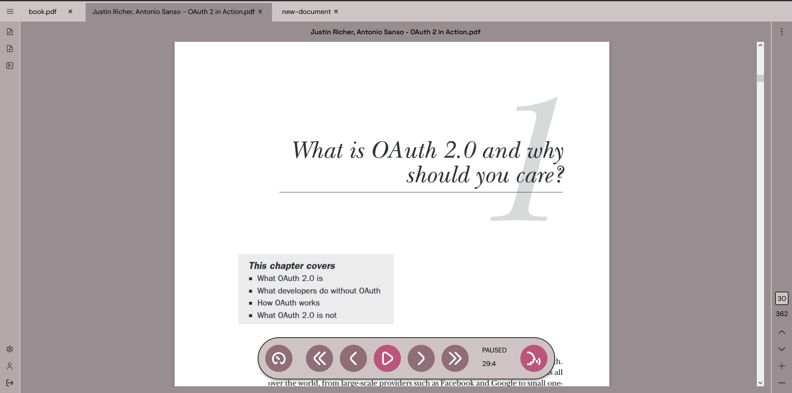
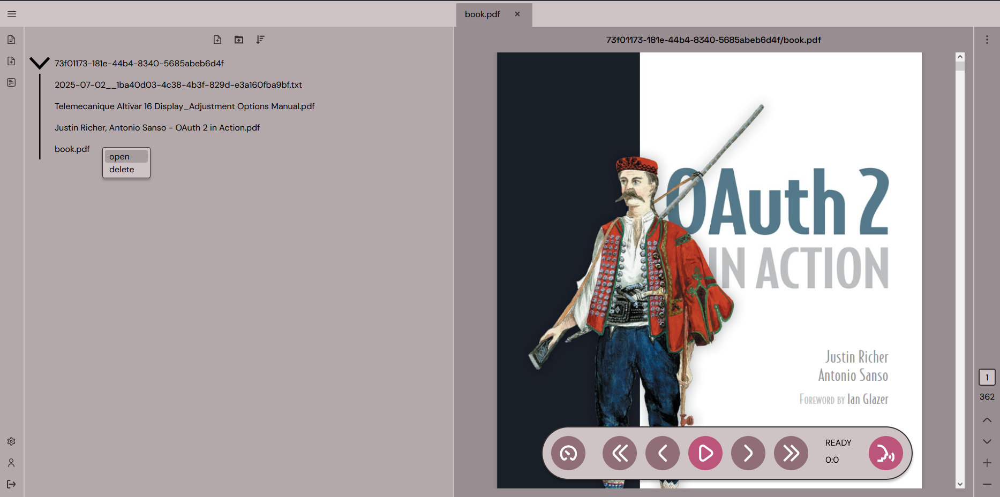
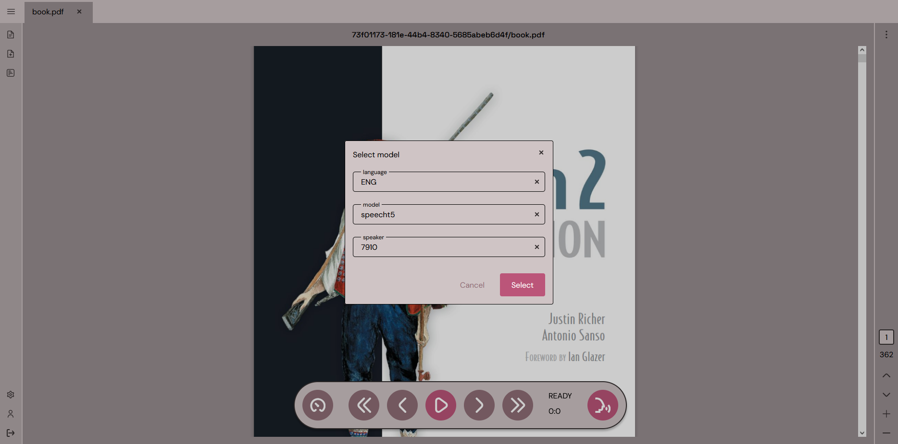
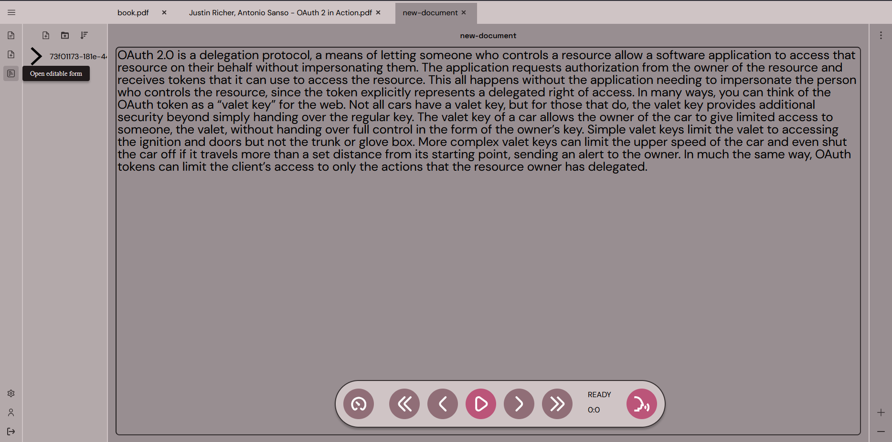

# Text-to-Speech System

## Table of Contents
* [General Info](#general-information)
* [Documentation](#documentation)
* [Services](#services)
* [Demo](#demo)
* [Technologies Used](#technologies-used)
* [Screenshots](#screenshots)
* [Project Status](#project-status)

## General Information
The Text-to-Speech System is designed to process text files (TXT, PDF), convert them into audio using Text-to-Speech models, and enable audio playback. Its core components include an Angular-based Frontend application, a Synthesizer application responsible for text-to-audio conversion, a File Storage application for managing files, and Keycloak as an identity provider.

## Documentation
Complete documentation is available in the [.doc folder](./.doc/doc.md).

## Services
Sytem is composed of two services:
- Front - [Github](https://github.com/dawidbladek0831/f19-front)
- Synthesizer - [Github](https://github.com/dawidbladek0831/f19-synthesizer)

## Demo
Live demo:
- https://f19.dev.dawidbladek0831.org/, or
- https://f19.dawidbladek0831.org/

## Technologies Used
- Angular
- FastAPI
- Keycloak

## Screenshots
Main view after opening a PDF file in the application.

File menu allowing users to open or delete uploaded files.

Dialog window for selecting a Text-to-Speech model.

Editable text view for modifying the loaded file content before synthesis.

## Project Status
Project is: _no longer being worked on_. B